<div align="center">


# 🏠 InmobilarIA

### El sistema operativo inteligente para inmobiliarias modernas

**CRM inmobiliario premium con IA integrada — captación, gestión, automatización y cierre en una sola plataforma.**

[](#estado-del-proyecto)
[](#seguridad)
[](#seguridad)
[](#estado-del-proyecto)

`IA` · `Multi-tenant` · `SaaS Web` · `Dark mode enterprise`

</div>

---

> ⚠️ **Repositorio de presentación (showcase).** Aquí se muestran las **capacidades y la experiencia** del producto.
> **No** contiene código fuente, lógica de negocio ni configuración de despliegue.

---

## ¿Qué es InmobilarIA?

**InmobilarIA** es una plataforma inmobiliaria SaaS premium que convierte la operativa diaria de una agencia en un flujo inteligente y automatizado. No es un CRM más: es un **sistema operativo inmobiliario** que integra inteligencia artificial en cada etapa del negocio, desde la captación del lead hasta la firma del contrato.

Construida como producto **multi-tenant**, cada agencia opera en un espacio totalmente aislado —datos, usuarios, branding y configuración propios.

---

## El problema que resuelve

Las agencias inmobiliarias pierden operaciones por fricción operativa: leads sin seguir, tareas manuales repetitivas, contenido lento de producir y datos dispersos en hojas de cálculo y chats. InmobilarIA centraliza captación, CRM, contenido y cierre en una sola plataforma, y delega en IA el trabajo repetitivo para que el equipo comercial dedique su tiempo a vender.

**Beneficios clave:**
- **Más cierres, menos fricción** — pipeline visual con priorización por IA
- **Captación 24/7** — agente de WhatsApp que responde y cualifica solo
- **Contenido en minutos** — anuncios, home staging y vídeo generados con IA
- **Decisiones con datos** — analítica en tiempo real del embudo comercial
- **Listo para equipos** — roles, permisos y métricas de rendimiento por agente

---

## Características

### CRM Inmobiliario
Pipeline Kanban de 8 etapas (nuevo lead → cerrado ganado/perdido). Drag-and-drop, historial completo de actividad, notas, documentos y comunicaciones por cada lead.

### Gestión de Propiedades
Cartera ilimitada de inmuebles con ficha completa, galería de fotos, mapa interactivo con clustering dinámico, filtros avanzados, comparador hasta 4 propiedades y dossier PDF corporativo. Panel lateral premium con diseño Airbnb/Idealista.

### Tour Virtual 360°
Visor panorámico WebGL disponible en cada propiedad. Salas procedurales cuando no hay fotos 360°, hotspots de navegación entre salas, fallback limpio si no hay GPU.

### Gestión de Clientes
Perfiles completos de compradores, vendedores, arrendatarios e inversores. Historial de visitas, documentos adjuntos, resumen AI y scoring de interés automático.

### Matching IA
Algoritmo de compatibilidad cliente-propiedad basado en presupuesto, preferencias, zona y características. Portal privado por cliente con propiedades ordenadas por relevancia.

### Portal de Clientes
Cada cliente recibe un enlace privado (token único) con acceso a propiedades seleccionadas según su perfil. Puede marcar "me interesa / no me interesa" y dejar comentarios por propiedad.

### WhatsApp Business
Agente de IA activo 24/7 que responde consultas, cualifica leads y captura información de contacto automáticamente. Campañas con templates personalizables por organización.

### Multi-portal
Publicación en portales inmobiliarios (Idealista, Fotocasa, etc.) con un clic desde la ficha del inmueble.

### Analytics
Dashboard con KPIs en tiempo real, funnel de ventas, evolución mensual de leads, rendimiento por agente e insights generados por IA.

### Automatizaciones
Reglas por evento (triggers + actions) para nutrir leads sin intervención manual. Templates predefinidas para los flujos más comunes.

### Calculadoras financieras
5 calculadoras: hipoteca, gastos de compra, rentabilidad, **capacidad de compra** (cualificación del comprador) y **rentabilidad avanzada** (ROI, cash flow, análisis de inversión completo), con exportación a PDF/CSV.

### Multi-tenant SaaS
Cada agencia opera en un entorno completamente aislado. El aislamiento se implementa a nivel de ORM — no requiere lógica adicional en cada pantalla.

---

## AI Center — 11 módulos de inteligencia artificial

| Módulo | Función |
|---|---|
| 🤖 Asistente IA | Chat comercial con herramientas (buscar propiedades, agendar visitas, crear tareas) |
| 📊 Lead Scoring | Score 0-100 por lead, historial y panel de top leads |
| 📝 Anuncios IA | 8 formatos: Idealista, Fotocasa, Instagram, TikTok, Facebook, AirBnB, Luxury, Familia |
| 🏠 Home Staging | Transformación visual de estancias vacías para foto profesional |
| 🎬 Video Studio | Composición automática de imágenes + música → vídeo MP4 |
| 🔍 Vision Search | Buscar propiedades similares por imagen |
| 💰 Tasación Visual | Foto + ciudad → valoración estimada del mercado |
| 📐 Floorplan AI | Análisis de planos: habitaciones, m², sugerencias de layout |
| 🧠 AI Memory | Contexto persistente del cliente en todas las conversaciones |
| ⚡ Automations | Workflows disparados por eventos con acciones IA |
| 📈 AI Metering | Control de gasto en tokens por usuario y modelo |

---

## Capturas de pantalla

> Capturas reales de la aplicación con **datos de demostración** (sin información personal real).

### Panel y analítica

| Dashboard | Analytics IA |
|---|---|
|  |  |

| Pipeline CRM | Lead Scoring IA |
|---|---|
|  |  |

### Propiedades y clientes

| Propiedades | Ficha de inmueble |
|---|---|
|  | 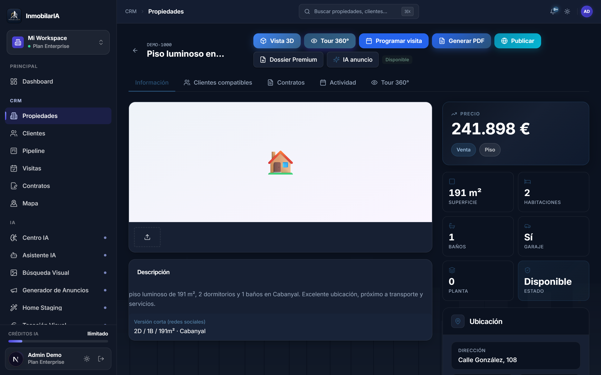 |

| Mapa interactivo | Clientes (CRM) |
|---|---|
| 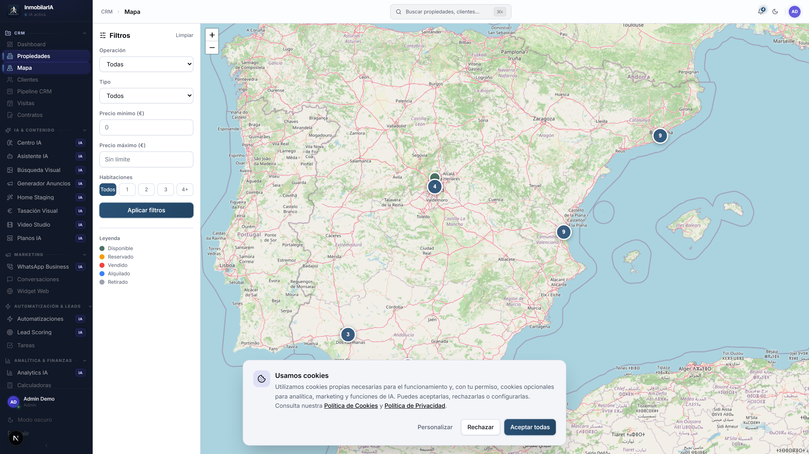 | 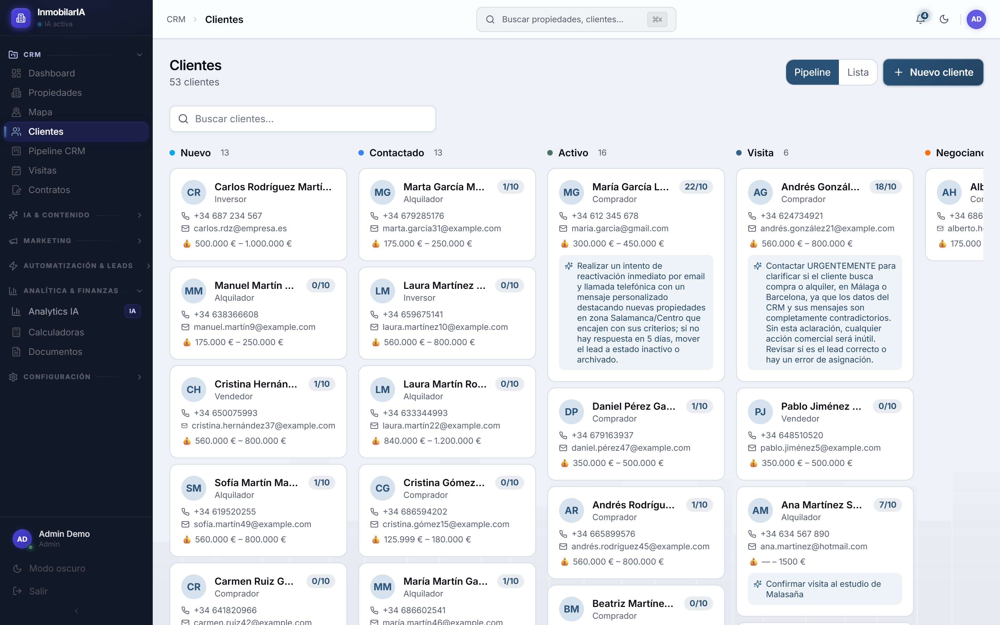 |

### Funcionalidades premium con IA

| Home Staging IA | Video Studio IA |
|---|---|
| 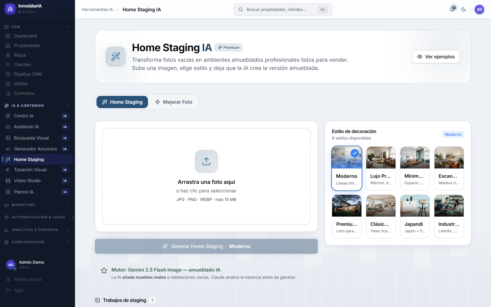 |  |

| Generador de anuncios IA | Automatizaciones |
|---|---|
| 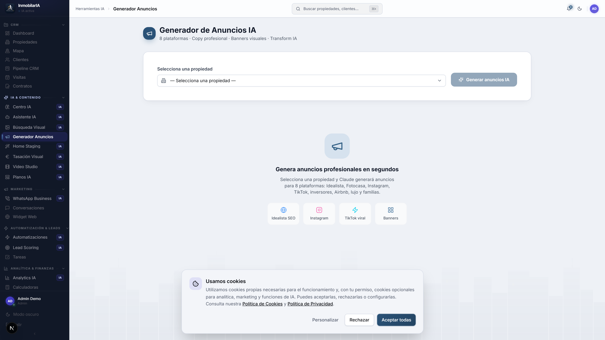 | 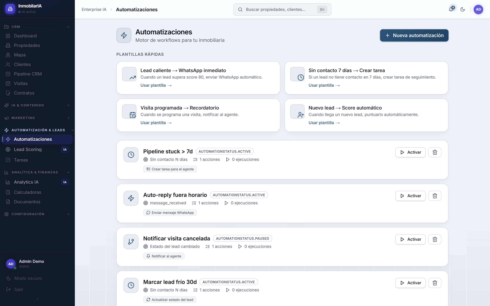 |

| WhatsApp Business | Calculadoras financieras |
|---|---|
| 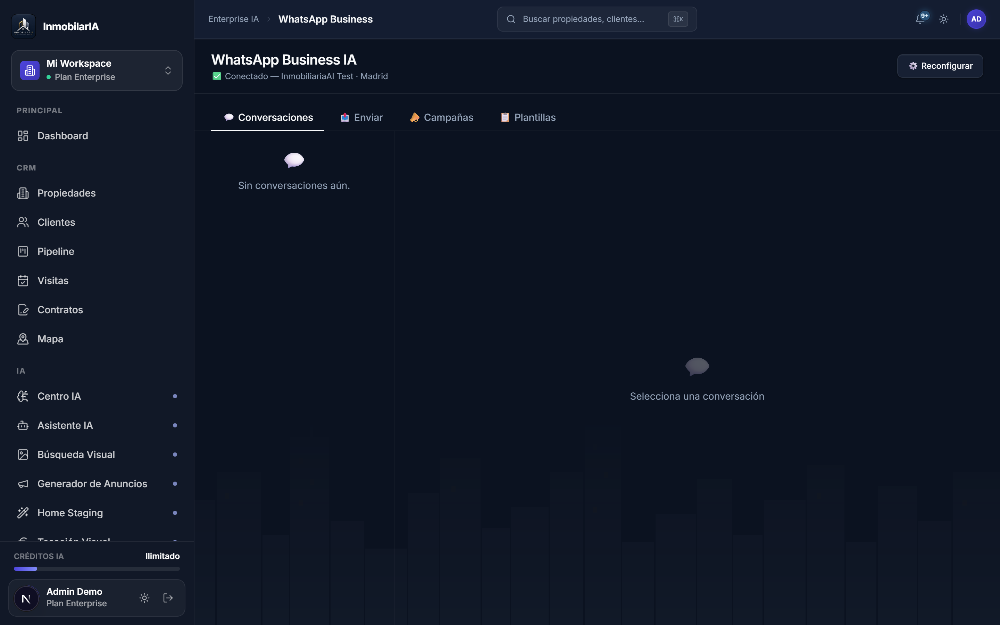 |  |

| Agentes | Visitas |
|---|---|
| 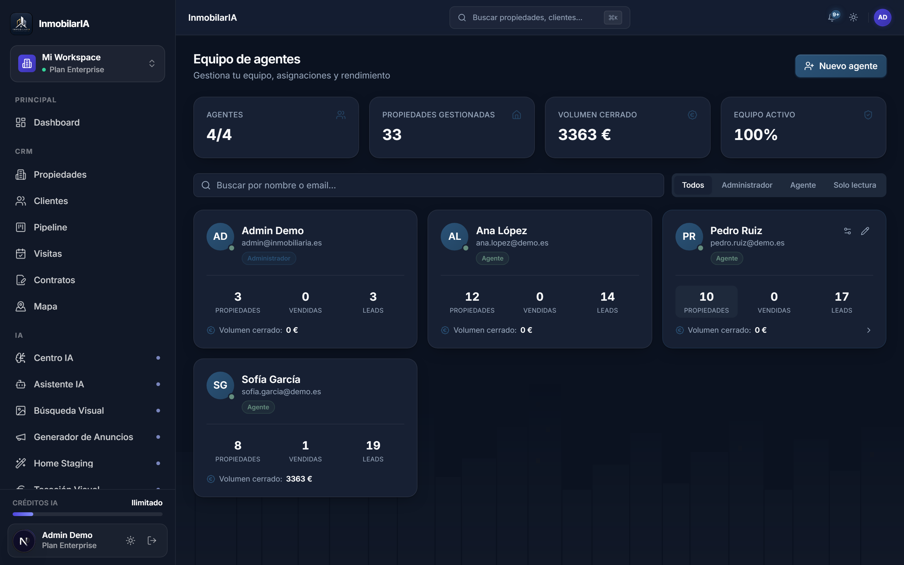 | 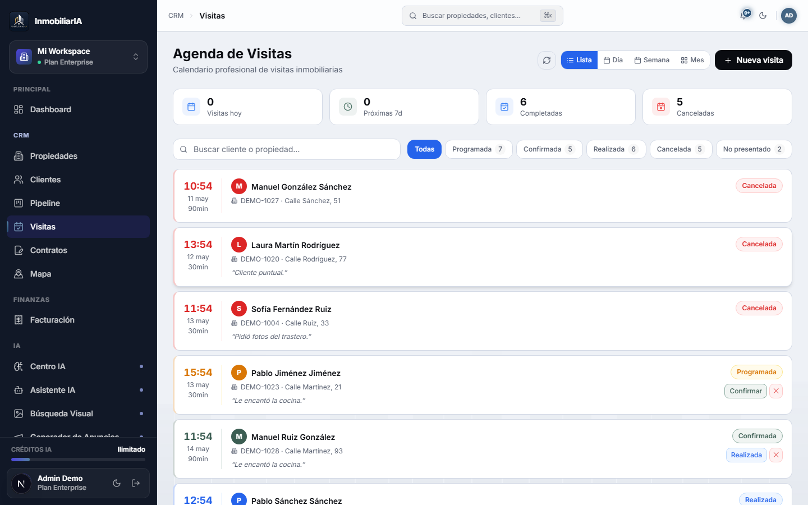 |

### FHD / alta resolución

| Dashboard FHD | Propiedades FHD |
|---|---|
| 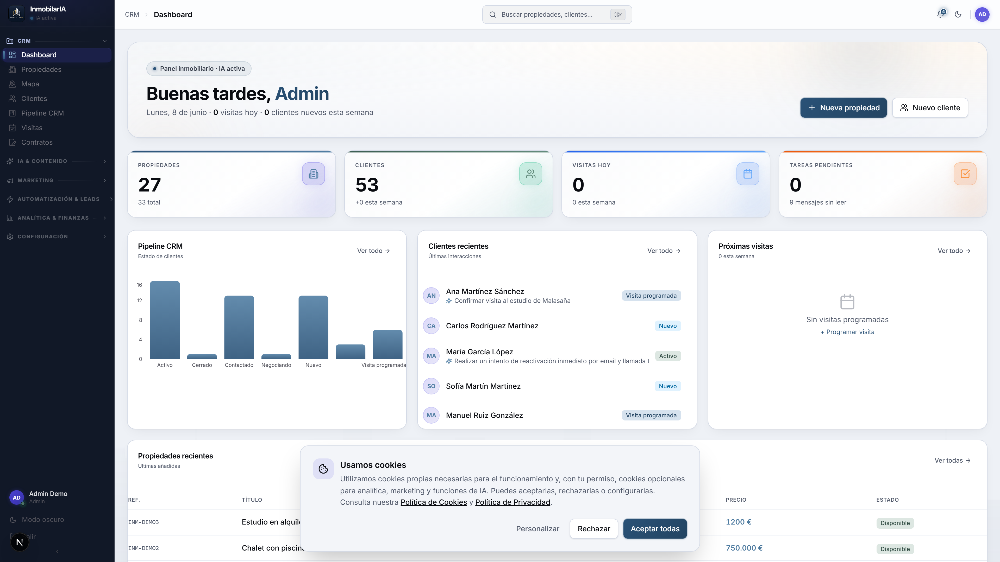 | 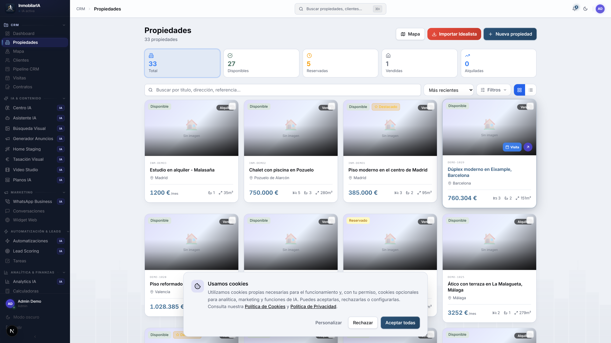 |

### Responsive

| Móvil — Dashboard | Móvil — Propiedades |
|---|---|
|  | 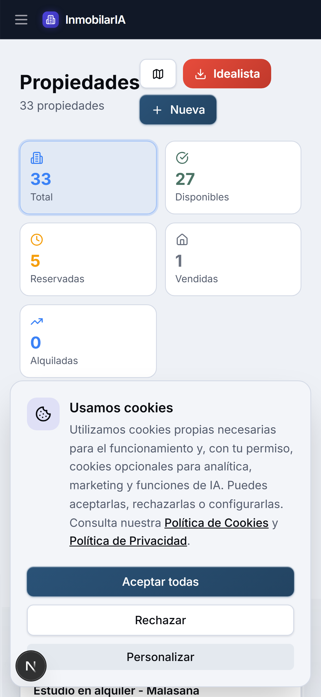 |

---

## Seguridad

InmobilarIA implementa un modelo de seguridad de nivel enterprise auditado en junio de 2026 (14 rondas de auditoría).

### Aislamiento Multi-Tenant
Cada agencia opera en un entorno de datos completamente aislado. El aislamiento se aplica automáticamente a nivel de ORM — es imposible que los datos de una agencia sean visibles para otra, incluso ante errores en los handlers.

### Autenticación
JWT con refresh tokens. Contraseñas hasheadas con bcrypt. Contraseña de administrador de producción generada automáticamente. Roles por usuario (admin / agente / visualización).

### Rate Limiting
Protección por IP en todos los endpoints sensibles: login (5/min), chat AI (20/min), widget embebido (20/min), webhooks (10/min).

### Verificación de Webhooks
Los webhooks de WhatsApp se validan con HMAC-SHA256 usando comparación en tiempo constante para prevenir timing attacks.

### Tests de Seguridad
**151 tests en verde**, incluyendo 16 tests de regresión específicos para los controles de seguridad.

---

## Estado del Proyecto

| Métrica | Estado |
|---|---|
| Tests (backend + frontend) | **151 + 32 passing** ✅ |
| TypeScript errors | **0** ✅ |
| Multi-tenant implementado | **Sí, nivel ORM** ✅ |
| Seguridad auditada | **14 rondas · 82/100** ✅ |
| Build producción | **49 rutas compiladas** ✅ |
| Versión actual | **v0.8.0** |
| Distribución | SaaS Web · Docker |

---

## Casos de uso

- **Agencia boutique** — un equipo pequeño gestiona toda su cartera y cierra más rápido con priorización por IA.
- **Red con varias oficinas** — cada oficina opera aislada (multi-tenant) bajo una misma plataforma.
- **Equipo de captación** — el agente de WhatsApp cualifica leads entrantes fuera de horario.
- **Marketing inmobiliario** — anuncios y home staging generados en minutos, no en días.

---

## Arquitectura (simplificada)

```
Agentes / Clientes
       ↓
Frontend Web (Next.js 16)
       ↓
API de Servicios (FastAPI) · Middleware de Seguridad
       ↓
Base de Datos (SQLite dev / PostgreSQL prod)
       ↓
Servicios IA (Anthropic Claude · Gemini · Stability AI)
```

> El detalle de implementación, versiones e infraestructura interna se mantiene privado de forma intencionada.

---

## Roadmap

Ver [ROADMAP_PUBLIC.md](ROADMAP_PUBLIC.md) para el roadmap completo con prioridades.

**Entregado recientemente:**
- [x] Tour virtual 360° con visor WebGL y salas procedurales
- [x] Multi-portal: publicación en portales con un clic
- [x] Módulo de agentes con métricas reales de rendimiento
- [x] Calculadoras de capacidad de compra y rentabilidad avanzada
- [x] Hardening de seguridad multi-tenant (v0.8.0)
- [x] 151 tests en verde

**Próximos pasos:**
- [ ] Matching UI (coincidencias cliente-propiedad)
- [ ] Contratos avanzados (ofertas, firma digital)
- [ ] Emails automáticos de visitas
- [ ] Billing (Stripe)
- [ ] App móvil nativa

---

## Demo

Recorrido visual del producto: **[Demo en vivo](https://svetoslav1999.github.io/inmobiliaria-demo/)**

---

## Contacto

¿Interesado en el producto o en una demostración? Abre un *issue* en este repositorio o contacta a través de [sveti99fm@gmail.com](mailto:sveti99fm@gmail.com).

---

## Código fuente

El código fuente de este proyecto es **privado**.

Este repositorio tiene como finalidad mostrar las capacidades y funcionalidades del producto sin exponer la implementación interna. Ver el [informe de seguridad del showcase](SHOWCASE_SECURITY_REPORT.md).

---

<div align="center">

© InmobilarIA 2026 · Todos los derechos reservados

</div>

